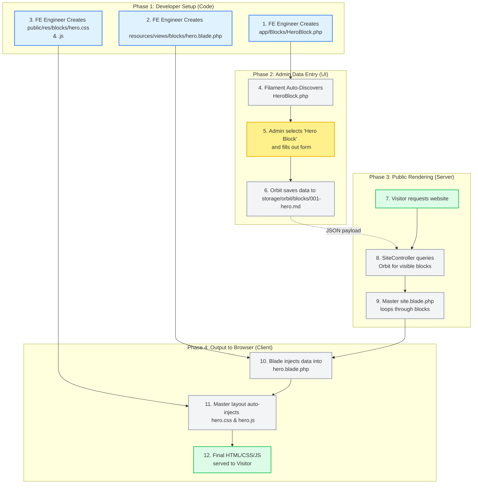

# Frontend Engineer Workflow & Data Pipeline

This document provides a high-level visual and structural map of how data moves through the LawndingPage architecture, and exactly where the Frontend Engineer fits into that pipeline.

---

## 1. The Data Flow (Mermaid Diagram)

This flowchart illustrates the complete journey of a UI Block—from the moment the Frontend Engineer creates the definition, through the Admin input, down to the final rendering in the visitor's browser.

---

## 2. Implementation Details: The Frontend Engineer's Role

The diagram above shows the entire system, but the Frontend Engineer is only responsible for **Phase 1**. The framework automatically handles Phases 2, 3, and 4.

Here is the step-by-step implementation checklist for the Frontend Engineer when creating a new UI Block.

### Step 1: Define the Data Requirements (PHP)
The engineer must tell the admin panel what data the new UI block needs.

1.  **Action:** Create `app/Blocks/[Name]Block.php`.
2.  **Implementation:** Write the Filament schema.
3.  **Mental Model:** *"I am building the form the client will see. If my UI needs a title, an image, and a color hex code, I must add a `TextInput`, a `FileUpload`, and a `ColorPicker` to this schema."*

### Step 2: Build the HTML Structure (Blade)
The engineer must map the data collected in Step 1 to standard HTML.

1.  **Action:** Create `resources/views/blocks/[name].blade.php`.
2.  **Implementation:** Write standard HTML and use Blade tags (`{{ $title }}`) to echo the data. Use `@if(!empty($image))` to prevent rendering empty elements.
3.  **Mental Model:** *"I am writing a dumb template. It makes no API calls. The server will hand me a variable for every field I defined in Step 1. I just need to place them in the HTML."*

### Step 3: Style the Component (CSS)
The engineer styles the block.

1.  **Action:** Create `public/res/blocks/[name].css` (if required).
2.  **Implementation:** Write standard CSS. **Crucially, all selectors must be scoped** to a unique parent class (e.g., `.block-hero h2 { ... }`) to prevent global style bleeding.
3.  **Mental Model:** *"Because there is no build step, I cannot use SCSS or Tailwind utility classes. I write plain CSS. The system will automatically link this file in the `<head>` if my block is on the page."*

### Step 4: Add Interactivity (Vanilla JS)
The engineer adds behavior (clicks, sliders, modals).

1.  **Action:** Create `public/res/blocks/[name].js` (if required).
2.  **Implementation:** Write standard JavaScript. **Crucially, the code must be wrapped in an IIFE** `(function() { ... })();` to protect the global scope. The script must also account for multiple instances of the block on the same page by using `document.querySelectorAll('[data-block-type="name"]')` and looping through them.
3.  **Mental Model:** *"I do not use Vue or React. I use vanilla DOM queries. Because the client might add three of these blocks to the same page, my code must loop through each instance and isolate its logic so they don't interfere with each other."*